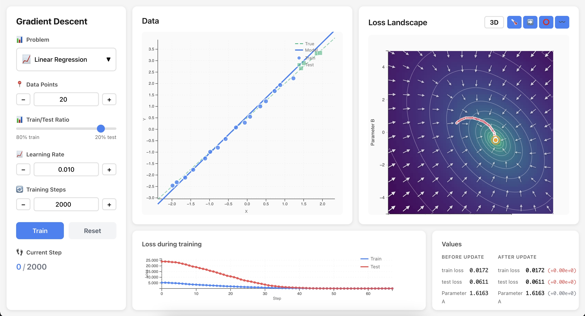

# Gradient Descent Visualization

An interactive educational tool for visualizing and understanding the gradient descent algorithm across different machine learning problems. Built with Svelte, TypeScript, and D3.js.




## 🎯 Features

### Interactive Loss Landscape
- **2D Heatmap**: Visualize the loss function as a color-coded landscape
- **3D Surface**: Explore the loss surface in three dimensions with interactive camera controls
- **Contour Lines**: See level curves of constant loss values
- **Gradient Field**: Vector arrows showing the direction of steepest descent
- **Real-time Updates**: Watch the landscape change as you modify data or parameters

### Multiple Machine Learning Problems
- **Linear Regression**: Learn how gradient descent finds the best-fit line
- **Logistic Regression**: Understand classification with decision boundaries
- **Polynomial Regression**: Explore non-linear relationships
- More problems coming soon!

### Training Visualization
- **Optimization Path**: See the exact path gradient descent takes through parameter space
- **Loss History**: Track training and test loss over time to understand overfitting
- **Parameter Evolution**: Watch how model parameters A and B change during training
- **Interactive Training**: Start, stop, and continue training from any point

### Educational Controls
- **Draggable Parameters**: Click and drag the current position to explore different starting points
- **Data Generation**: Adjust the number of data points and train/test split
- **Learning Rate**: Experiment with different learning rates and their effects
- **Training Steps**: Control how many optimization steps to take
- **Reset Functionality**: Start fresh with randomized parameters

## 🚀 Getting Started

### Prerequisites
- Node.js (v16 or higher)
- npm or yarn

### Installation

1. Clone the repository:
```bash
git clone <repository-url>
cd gradient-descent-visualization
```

2. Install dependencies:
```bash
npm install
```

3. Start the development server:
```bash
npm run dev
```

4. Open your browser and navigate to `http://localhost:5173`

### Building for Production

```bash
npm run build
```

The built files will be in the `dist` directory.

## 🎮 How to Use

### Basic Workflow
1. **Select a Problem**: Choose from Linear Regression, Logistic Regression, or Polynomial Regression
2. **Adjust Data**: Set the number of data points and train/test split ratio
3. **Explore the Landscape**: Toggle between 2D and 3D views, enable different visualizations
4. **Set Training Parameters**: Choose learning rate and number of training steps
5. **Train the Model**: Click "Train" to watch gradient descent in action
6. **Experiment**: Drag the orange marker to different starting positions and continue training

### Understanding the Visualizations

#### Loss Landscape (Main Panel)
- **Heatmap Colors**: Purple (high loss) → Green (low loss)
- **Contour Lines**: White lines connecting points of equal loss
- **Gradient Arrows**: White arrows showing steepest descent direction
  - Arrow length indicates gradient magnitude
  - All arrows point toward the minimum
- **Orange Circle**: Current parameter values (A, B)
- **Red Path**: Optimization trajectory showing where gradient descent has traveled

#### Data Visualization (Top Left)
- **Blue Line**: Current model prediction
- **Green Dashed Line**: True underlying model (for comparison)
- **Circles**: Data points (blue = training, gray = test)
- **For Classification**: Decision boundaries shown as vertical lines

#### Loss History (Bottom Left)
- **Blue Line**: Training loss over time
- **Red Line**: Test loss over time
- **Gap Between Lines**: Indicates overfitting when test loss is much higher

#### Parameter Display (Bottom Right)
- **Current Values**: Numerical display of parameters A and B
- **Loss Values**: Current training and test loss

### Tips for Learning

1. **Start Simple**: Begin with Linear Regression and few data points
2. **Compare Learning Rates**: Try very small (0.01) vs large (0.5) learning rates
3. **Watch Overfitting**: Use different train/test splits to see generalization
4. **Explore Starting Points**: Drag the marker to different locations and observe convergence
5. **3D Perspective**: Switch to 3D view to better understand the loss surface shape

## 🛠 Technical Details

### Architecture
- **Frontend Framework**: Svelte with TypeScript
- **Build Tool**: Vite
- **Visualizations**: D3.js for 2D graphics, Three.js for 3D rendering
- **Styling**: Modern CSS with Flexbox/Grid layouts
- **State Management**: Svelte stores for reactive data flow

### Key Components
- `App.svelte`: Main application layout and orchestration
- `Sidebar.svelte`: Control panel with all user interactions
- `LossLandscape.svelte`: Core visualization component (2D/3D loss surface)
- `DataVisualization.svelte`: Data points and model predictions
- `LossHistory.svelte`: Training progress charts
- `ParameterDisplay.svelte`: Numerical parameter and loss display

### Performance Optimizations
- **Efficient Gradient Computation**: Cached gradient field calculations
- **Responsive Rendering**: Debounced resize handling and optimized re-renders
- **Smart Updates**: Only recalculate visualizations when necessary
- **Memory Management**: Proper cleanup of Three.js resources

### Educational Design Principles
- **Progressive Disclosure**: Start simple, add complexity gradually
- **Multiple Representations**: Same concepts shown in different ways
- **Interactive Exploration**: Learn by doing and experimenting
- **Immediate Feedback**: Real-time updates show cause and effect
- **Visual Consistency**: Coordinated colors and symbols across all panels

## 🤝 Contributing

Contributions are welcome! Here are some ways you can help:

### Adding New Problems
1. Create a new problem configuration in `src/utils/problems.ts`
2. Implement the required functions: `generateData`, `predict`, `computeLoss`, `computeGradient`
3. Add appropriate visualization logic if needed
4. Update the problem selector in the sidebar

### Improving Visualizations
- Enhance the 3D rendering with better materials or lighting
- Add new visualization modes (e.g., parameter sensitivity analysis)
- Improve accessibility with better color schemes or keyboard navigation

### Bug Reports and Feature Requests
Please use the GitHub issue tracker to report bugs or request features.

## 📚 Educational Context

This tool is designed for:
- **Students** learning machine learning fundamentals
- **Educators** teaching optimization and gradient descent
- **Practitioners** building intuition about hyperparameter effects
- **Anyone curious** about how machine learning algorithms work

### Learning Objectives
After using this tool, learners should understand:
- How gradient descent navigates parameter space to minimize loss
- The relationship between learning rate and convergence behavior
- Why different starting points can lead to different solutions
- How training and test loss relate to overfitting
- The geometric interpretation of loss functions and optimization

## 📄 License

This project is licensed under the MIT License - see the LICENSE file for details.

## 🙏 Acknowledgments

- Built with [Svelte](https://svelte.dev/) and [Vite](https://vitejs.dev/)
- Visualizations powered by [D3.js](https://d3js.org/) and [Three.js](https://threejs.org/)
- Inspired by educational tools like [TensorFlow Playground](https://playground.tensorflow.org/)
- Color schemes from [D3 Scale Chromatic](https://github.com/d3/d3-scale-chromatic)

---

**Happy Learning!** 🎓 Explore the fascinating world of gradient descent and machine learning optimization.