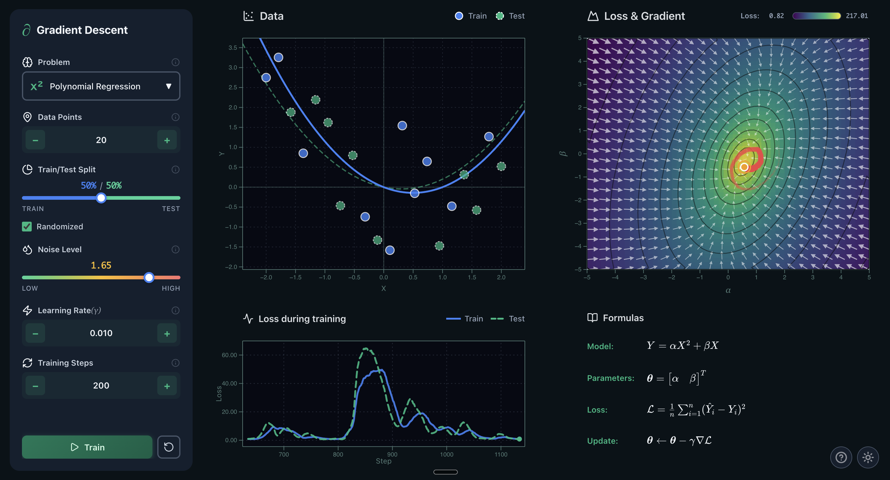

# ∂ Gradient Descent Explorer

[](https://svelte.dev/)
[](https://www.typescriptlang.org/)
[](https://vitejs.dev/)
[](https://d3js.org/)
[](LICENSE)

An interactive visualization tool for understanding gradient descent through beautiful, real-time animations and mathematical rigor.

**[🚀 Live Demo](https://neovand.github.io/GradientDescent/)**



## ✨ Features

- **Interactive Gradient Field**: Visualize loss landscapes with color-coded heatmaps and gradient vector fields
- **Real-time Training**: Watch gradient descent optimize in real-time with animated parameter trails
- **Multiple Problem Types**: Explore linear regression, logistic classification, and polynomial regression
- **Beautiful LaTeX Formulas**: Professional mathematical notation rendered with KaTeX
- **Dark/Light Themes**: Elegant emerald-themed interface with seamless theme switching
- **Educational**: Comprehensive help modal with theory and suggested experiments

## 🎯 What It Does

Gradient Descent Explorer helps you understand optimization algorithms through visual experimentation:

- **Drag** the orange marker to manually explore parameter space
- **Train** the model to watch gradient descent find optimal solutions automatically
- **Experiment** with learning rates, noise levels, and data splits
- **Observe** how loss landscapes change with different configurations

> **💡 Tip**: Drag the orange marker on the Loss & Gradient diagram to explore the connection between parameters, the model, and loss in real-time.

## 🚀 Quick Start

### Prerequisites

- Node.js 20 or higher
- npm

### Local Development

```bash
# Clone the repository
git clone https://github.com/neovand/GradientDescent.git
cd GradientDescent

# Install dependencies
npm install

# Start development server
npm run dev
```

The app will open at `http://localhost:5173`

### Build for Production

```bash
npm run build
npm run preview
```

## 🛠️ Built With

- **[Svelte 5](https://svelte.dev/)** - Reactive UI framework
- **[D3.js](https://d3js.org/)** - Data visualization and SVG rendering
- **[KaTeX](https://katex.org/)** - Fast LaTeX math rendering
- **[Lucide Icons](https://lucide.dev/)** - Beautiful icon library
- **[Vite](https://vitejs.dev/)** - Lightning-fast build tool

## 📐 Mathematical Foundation

The app visualizes the gradient descent update rule:

**θ** ← **θ** - γ∇ℒ

where **θ** = [α, β]ᵀ are the parameters, γ is the learning rate, and ∇ℒ is the gradient of the loss function.

## 🎨 Key Visualizations

- **Data Plot**: Training and test data with model predictions
- **Loss & Gradient**: Combined heatmap and vector field showing the optimization landscape
- **Loss History**: Training dynamics with sliding window display (last 500 steps)
- **Formulas**: Real-time LaTeX-rendered equations

## 📄 License

MIT License - see [LICENSE](LICENSE) for details

## 👨‍💻 Author

**Neo Mohsenvand**

Developed with ∂ for educational purposes

---

## ⭐ Show Your Support

If you find this project helpful for learning or teaching gradient descent, please consider giving it a star! Your support helps make educational tools like this more visible to students and educators worldwide.

[](https://github.com/neovand/GradientDescent/stargazers)

---

*Explore, experiment, and understand gradient descent like never before.*
