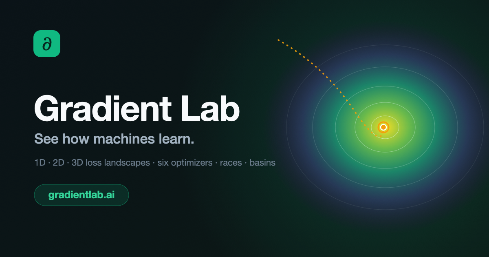

# ∂ Gradient Lab

[](https://svelte.dev/)
[](https://www.typescriptlang.org/)
[](https://vitejs.dev/)
[](https://d3js.org/)
[](LICENSE)

Gradient Lab is a free, interactive tool for understanding gradient descent and optimization through beautiful, real-time animations and mathematical rigor.

**[🚀 Live at gradientlab.ai](https://gradientlab.ai/)**




## ✨ Features

### The landscape, three ways
- **1D Loss Curves**: one-parameter problems render the whole landscape as a single curve, its fill colored by the loss itself — marker on the curve, live tangent line, and an amber ghost previewing the optimizer's next step
- **Interactive 2D Landscape**: color-coded heatmap, smooth contour lines, and gradient vector field in one view
- **Rotatable 3D Surface**: same cached grid, same colors, draggable marker, tapered fading descent trail, and a corner axes gizmo

### Optimization, end to end
- **Six Optimizers**: Gradient Descent, Momentum, Nesterov, AdaGrad, RMSProp, and Adam — each with hyperparameter sliders and a live LaTeX update rule
- **Learning-Rate Schedules**: constant, step decay, cosine, and warmup+cosine, with the γ(t) shape drawn on the loss chart
- **Race Mode**: GD, Momentum, RMSProp, and Adam from the same start — colored trails in 2D *and* 3D, steps-to-basin scoreboard
- **Stochastic Gradients**: a batch-size control turns descent into SGD, and a fan of faint batch-gradient rays at the marker makes the noise distribution visible
- **Optimizer X-ray**: blue −∇ℒ vs. red Δθ arrows at the marker — the gap IS the optimizer
- **Curvature Lens**: the local Hessian's principal-axis ellipse, condition number κ, saddle escape directions, and a violet Newton-step ghost
- **Basins of Attraction**: one toggle colors every point by which minimum GD reaches from there (computed in a Web Worker) — Himmelblau becomes a four-color map, convexity becomes one color

### Built for teaching
- **The Optimizer Story**: the help modal teaches all six optimizers as 170 years of fixes in three acts — Cauchy to Adam, opened by an animated race of four optimizers actually simulated on a curved ravine
- **A 10-Lesson Course**: guided lessons from "which way is down?" to a real tiny neural network — four explicit steps each (setup → predict → run → learn), freely navigable, draggable out of the way
- **Challenge Links**: share a URL with a goal ("reach the basin in ≤ 80 steps") — zero-backend homework with a 🏆 verdict
- **22 Problem Types**: 1D slopes and traps, curve fits, classifiers, localization, two AR(2) time series (one-step least squares, plus a k-step rollout whose exploding-gradient cliffs trace the stability triangle — BPTT in two parameters), a tiny neural net (β·tanh(αX) — mirror minima, dead saddle at zero-init), and the classic benchmarks (Rosenbrock, saddle, Himmelblau); every analytic gradient verified against finite differences
- **Keyboard Shortcuts**: Space train/pause · S step · R reset · arrows nudge the marker · D 2D/3D
- **Video Export**: render the last run to a WebM clip for slides
- **Works Offline**: installable PWA — lecture-hall wifi is not a dependency

### Always-on guidance
- **A Coach That Watches**: every run ends with a verdict — converged (with steps-to-basin), stalled, or out of steps — and every problem introduces itself
- **Divergence Coaching**: blow past a stable learning rate and the app stops, explains why, and keeps every chart alive
- **One-Click Experiments**: ready-made scenarios in the help modal that configure everything, train, and narrate
- **Editable Data**: click the data plot to add/remove points and watch the landscape reshape live
- **Shareable Links**: one click reproduces your exact dataset (seeded), optimizer, hyperparameters, schedule, and marker
- **Beautiful LaTeX Formulas**: KaTeX-rendered model, loss, gradient, and update rule, always in sync
- **Dark/Light Themes**: elegant emerald-themed interface with seamless switching

## 🎯 What It Does

Gradient Lab helps you understand optimization algorithms through visual experimentation:

- **Learn** with the built-in course: ten predict-then-run lessons from 1D slopes to a tiny neural network
- **Drag** the orange marker to manually explore parameter space
- **Train** the model — or **Step** through one update at a time — and watch the optimizer find solutions
- **Compare** optimizers: race them, or switch between GD, Momentum, Nesterov, AdaGrad, RMSProp, and Adam from the same starting point
- **Experiment** with learning rates, schedules, momentum, batch sizes, noise levels, and data splits
- **See deeper** with the curvature lens and the basins-of-attraction map
- **Assign** challenge links as homework: "reach the basin in ≤ N steps"

> **💡 Tip**: Drag the orange marker on the Loss & Gradient diagram to explore the connection between parameters, the model, and loss in real-time.

## 🚀 Quick Start

### Prerequisites

- Node.js 20 or higher
- npm

### Local Development

```bash
# Clone the repository
git clone https://github.com/NeoVand/GradientDescent.git
cd GradientDescent

# Install dependencies
npm install

# Start development server
npm run dev
```

The app will open at `http://localhost:5173`

### Build for Production

```bash
npm run build
npm run preview
```

### Deployment

The live site at **[gradientlab.ai](https://gradientlab.ai/)** (and **[www.gradientlab.ai](https://www.gradientlab.ai/)**) is hosted on **Cloudflare Pages**, which rebuilds and deploys automatically on every push to `main` (build command `npm run build`, output `dist`). GitHub Actions runs the type-check and test suite as a CI gate on every push and pull request. The app is fully static — no backend — and ships as an installable PWA. SEO basics (canonical URL, Open Graph / Twitter cards, JSON-LD, `robots.txt`, and `sitemap.xml`) are baked in.

## 🛠️ Built With

- **[Svelte 5](https://svelte.dev/)** - Reactive UI framework
- **[D3.js](https://d3js.org/)** - Data visualization and SVG rendering
- **[KaTeX](https://katex.org/)** - Fast LaTeX math rendering
- **[Lucide Icons](https://lucide.dev/)** - Beautiful icon library
- **[Vite](https://vitejs.dev/)** - Lightning-fast build tool

## 📐 Mathematical Foundation

The app visualizes the gradient descent update rule:

**θ** ← **θ** - γ∇ℒ

where **θ** = [α, β]ᵀ are the parameters, γ is the learning rate, and ∇ℒ is the gradient of the loss function.

## 🎨 Key Visualizations

- **Data Plot**: Training and test data with model predictions and decision boundaries (for classification)
- **Loss & Gradient**: Color-coded loss heatmap with iso-loss contour lines and gradient vector field
- **Loss History**: Training dynamics with sliding window display (last 500 steps) and current position markers
- **Formulas**: Real-time LaTeX-rendered equations showing model, parameters, loss, and update rules

## 📄 License

MIT License - see [LICENSE](LICENSE) for details

## 👨‍💻 Author

**Neo Mohsenvand**

Developed with ∂ for educational purposes

---

## ⭐ Show Your Support

If you find this project helpful for learning or teaching gradient descent, please consider giving it a star! Your support helps make educational tools like this more visible to students and educators worldwide.

[](https://github.com/neovand/GradientDescent/stargazers)

---

*Explore, experiment, and understand gradient descent like never before.*
